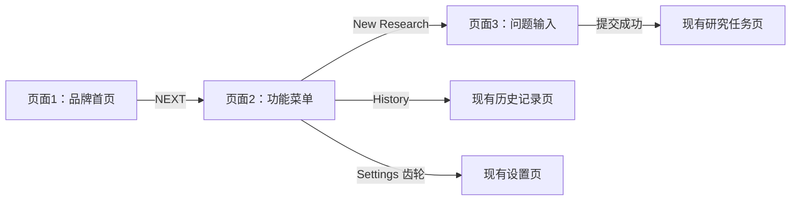
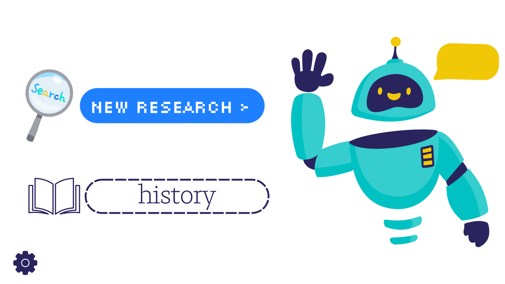
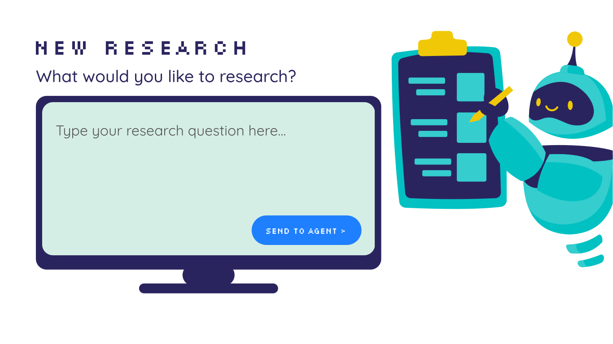

# Research Agent 三页设计说明与前端重构交接

更新日期：2026-10-02。适用项目：`D:\agent`。设计参考目录：`D:\agent\例子`。

## 1. 这份说明的用途

以用户导出的三页 Canva 设计为参考，重构现有 Next.js 前端。目标是把设计中的构图、字体搭配、机器人形象和页面流程落实为真实可操作的界面，而不是把整页图片铺在网页上。

**以本目录最新导出文件为视觉依据。** 用户在 Canva 中做过后续调整，尤其是第 3 页的机器人已放大、贴近右侧边缘；不要照搬较早对话中的截图或“机器人宽 450”的初版布局。下文的坐标和字号是设计基线，最新导出稿的实际视觉效果优先。

| 页面 | SVG 静态参考 | GIF 动态参考 | 功能 |
| --- | --- | --- | --- |
| 1：品牌首页 | [Research Agent · 简洁首页.svg](./Research%20Agent%20%C2%B7%20%E7%AE%80%E6%B4%81%E9%A6%96%E9%A1%B5.svg) | [Research Agent · 简洁首页.gif](./Research%20Agent%20%C2%B7%20%E7%AE%80%E6%B4%81%E9%A6%96%E9%A1%B5.gif) | 介绍产品并进入功能菜单 |
| 2：功能菜单 | [2.svg](./2.svg) | [2.gif](./2.gif) | New Research、History、Settings |
| 3：问题输入 | [3.svg](./3.svg) | [3.gif](./3.gif) | 输入研究问题并提交给 Agent |

- 三页导出尺寸均为 **1366 × 768**；SVG 内部 `viewBox` 为 `0 0 1024.5 576`。若读取 SVG 内部坐标，换算到这张 1366 × 768 画布时乘以 `4/3`。
- 第 2、3 页 GIF 带透明背景。透明像素的调色板 RGB 接近黄色，有的预览器忽略透明度后会显示黄色；**这不是黄色页面背景的设计要求**。前端应将其放在白色背景上，正确保留 alpha。
- 第 1 页为白色/近白色背景。GIF 导出片段分别为 5 秒、6 秒、6 秒，均循环播放；这只是本次导出时长，不代表 Canva 素材的原始目录周期。
- SVG 中的文字已转换成图形路径，没有可直接提取的 `<text>`。页面中的标题、按钮和输入文字应重新实现为 HTML 文本。
- GIF 包含整页内容，用于检查动作和构图，不适合直接作为整个可交互页面的背景资源。

## 2. 核心流程与设计原则

三页采用白色留白、大幅机器人插画和少量明确的操作入口。机器人是品牌主视觉，每页都要醒目，并且动作与当前功能相匹配。

用户明确要求：**不同用途的入口要有不同的字体与素材组合，但在同一个画面中保持协调。** 因此不要把 New Research、History、Settings 全部改成同款蓝色按钮，也不要把所有文字统一为一种字体。统一感来自机器人系列、有限的配色、合理的尺度和对齐，而不是入口样式完全相同。

### 配色

| 用途 | 颜色 |
| --- | --- |
| 页面基础背景 | `#FFFFFF`，首页允许参考稿中的近白色质感 |
| NEXT / New Research / Send to Agent 主按钮 | `#1F80FF` |
| History 文字与轮廓、电脑外框、页面 3 标题 | `#2A245E` |
| 机器人主体青绿 | `#02C1C2` |
| 机器人浅青绿 | `#35CDCE` |
| 机器人天线、清单、表情点缀 | `#F0C808` |
| 电脑屏幕浅薄荷色 | `#D5EEE5` |
| 输入占位文字及首页灰色文字 | `#545454` |
| 首页大型像素字的浅蓝主色 | `#58B7FF`，阴影/错位效果以 SVG 为准 |

黄色主要属于机器人和道具点缀，不扩展为整页背景。

### 字体分工

| 内容 | 设计字体与风格 |
| --- | --- |
| NEXT、New Research 主入口、页面 3 标题、发送按钮 | `SCR-N Five`，像素风，通常使用白色或深蓝色 |
| 首页 `is power`、`Agent` 与页面 2 的 `history` | `29LT Zarid Serif` 极细字重，轻盈的衬线风格 |
| 页面 3 引导文字 | `Quicksand` Medium，深蓝色，自然字距 |
| 页面 3 输入内容/占位提示 | `Quicksand` Regular，自然字距 |
| 首页 `Data`、`Research` 大型装饰标题 | 带浅蓝色阴影/错位效果的像素字形，以导出图形为准；不要用普通正文替代 |

Canva 字号不能直接视为 CSS 像素。以下为原设计制作时的参考值：页面 2 主入口约 45.5、History 约 70；页面 3 标题 45、引导文字 28、占位文字 24、发送文字 18。按本次画布换算，45 约对应 60 CSS px，28 约对应 37.3 CSS px，24 约对应 32 CSS px，18 约对应 24 CSS px；最终用浏览器与导出图对照校准。

标题可保留适度的像素字距；Quicksand 正文使用正常字距，避免继承 History 的大字距。中文模式应使用可读的中文字体配套，保留各类文字的轻重和层级。

本次检查未在 `web/public` 下发现这些字体的字体文件。实现前检查现有字体配置与可用资源；有可用的原字体时优先使用原字体，缺失时明确说明替代方案，不要默默改成整站同一种默认字体。

## 3. 页面 1：品牌首页

### 构图与内容

- 中央为非常醒目的青绿机器人，拿黄色放大镜，表达搜索、探索和研究。
- 左侧口号分两层：浅蓝色像素字 `Data`，下方灰色极细衬线字 `is power`。
- 右上区域分两层：浅蓝色像素字 `Research`，下方灰色极细衬线字 `Agent`。
- 左上为浅蓝色圆角搜索图标，旁边是小型品牌介绍 `YOUR AI RESEARCH PARTNER`。
- 右上角保留语言入口，参考稿文字为 `简体中文`，接入已有中英文切换逻辑。
- 左下为蓝色圆角 `NEXT >` 按钮，白色像素文字。按钮独立于机器人，点击后进入页面 2。

### 重构重点

保持“左右文字围绕中央机器人”的品牌构图，留足文字与机器人之间的空间。NEXT 要是真实按钮/链接，可鼠标和键盘操作。不要因装饰图遮挡而导致入口不可点击。

首页大幅机器人使用 `Fintech Robot Doing Research` 姿态；按现有动画资源映射，对应可复用的 `search` 动画素材。

## 4. 页面 2：功能菜单

### New Research

- 位于左侧上方，手绘放大镜在左，蓝色胶囊按钮在右。
- 白色像素文字 `NEW RESEARCH >`，视觉权重最高，是创建研究的主入口。
- 原底形为 **500 × 95**，对应圆角胶囊。制作时位置约为 `x=216.2, y=238.1`，以最新导出稿对齐。
- 点击进入页面 3 的问题输入界面。

### History

- 位于左侧下方，深蓝色细线书本在左，极细衬线文字 `history` 在右，保留小写形式。
- 使用透明底、深蓝色**长虚线圆角轮廓**。轮廓尺寸与 New Research 一致，均为 **500 × 95**；线宽参考 5，圆角形成胶囊。
- 制作时轮廓位置约为 `x=229.2, y=483.5`。两行入口的实际对齐以导出稿为准，不能把图标包进同一个蓝色底块。
- 点击进入现有历史记录页。书本和按钮区域应有合理点击范围；图标属于该入口的视觉搭配。

### Settings

- **最新导出稿中 Settings 是左下角的独立深蓝色齿轮图标，没有文字标签或浅薄荷色按钮底。** 不要恢复较早版本的第三行 Settings 按钮。
- 齿轮为次要入口，点击进入现有设置页；补充 `aria-label` 和悬停/聚焦提示 `Settings`。
- 保持角落位置和较小视觉权重，同时保证至少 44 × 44 CSS px 的触摸目标。

### 机器人

右侧保留大幅挥手机器人及黄色气泡，使用 `Fintech Robot Waving` 姿态，对应现有 `idle` 素材。它传达欢迎和选择功能的状态，不遮挡左侧入口。

## 5. 页面 3：研究问题输入

### 构图

- 左侧为标题、引导文字和电脑屏幕输入区，右侧为持清单机器人。
- 标题为深蓝色像素字 `NEW RESEARCH`。
- 引导文字为 `What would you like to research?`，Quicksand Medium，深蓝色。
- 机器人使用 `Fintech Robot Marking Its Checklist`，水平翻转，使清单位于靠近电脑的一侧，表现准备记录研究任务。现有素材映射中可复用 `filter` 姿态，但**不能因此将未提交页面的业务状态设为 filter**。
- 最新导出稿的机器人显著放大，身体局部超出右侧画面。这一构图以最新文件为准；用独立的右侧插画容器控制溢出，不能让机器人压住文本输入或发送按钮。

### 电脑造型与尺寸基线

电脑由深蓝色圆角外框、浅薄荷色屏幕、支架和横向底座组成。屏幕本身就是输入区，不在里面再叠一个风格不一致的普通卡片。

| 元素 | 1366 × 768 画布参考尺寸/位置 |
| --- | --- |
| 标题 | 左起约 80，上起约 65 |
| 引导文字 | 左起约 80，上起约 148 |
| 显示器外框 | 770 × 388，`x=80, y=214`，圆角约 24 |
| 薄荷色内屏 | 742 × 342，`x=94, y=228` |
| 支架 | 116 × 48，`x=407, y=590` |
| 底座 | 310 × 22，`x=310, y=633` |
| 占位文字 | 左起约 124，上起约 272 |
| 蓝色发送按钮 | 245 × 66，`x=561, y=481`，胶囊圆角 |

### 真实输入与提交

- 输入区域实现为真实多行 `textarea`，占位文案 `Type your research question here...`，输入文字和占位文字都使用 Quicksand Regular。
- 预留至少四行输入空间；长内容在屏幕内部滚动，不能覆盖右下角发送按钮，也不能挤掉电脑底座。
- 蓝色按钮文案为 `SEND TO AGENT >`，白色像素字。提交行为复用项目已有创建研究任务逻辑。
- 保留现有问题校验：去掉首尾空白后至少 1 字符，最多 2000 字符。空白输入不能创建任务。
- 普通 Enter 换行；保留现有 Ctrl/Cmd + Enter 提交快捷键和中文输入法兼容性。
- 提交时防止重复发送，展示清晰加载状态；失败保留用户输入并提供重试。成功后进入已有研究任务页。
- 现有运行中任务冲突提示、返回运行中任务的入口和任务恢复能力需要保留，可在电脑区附近以轻量提示承载。

## 6. 前端重构落地约束

### 已检查的项目事实

- 项目主前端为 Next.js / TypeScript；根目录 `AGENTS.md` 是项目规则来源。
- 当前首页入口由 `web/app/page.tsx` 导出 WelcomePage；已有会话跳过首页、引导动画和进入 `/workspace` 的逻辑，改版时需要核对导航与会话行为。
- 当前 `/workspace` 展示 ResearchHomePage，它直接承载问题表单或运行中任务摘要。目标设计增加了独立的“页面 2 菜单”，因此需要区分菜单页和问题输入页，不能只更换一个现有表单卡片的颜色。
- 核心提交逻辑位于 `web/components/research/research-composer.tsx`：使用现有创建任务 hook、`client_request_id`、研究参数偏好与语言设置；成功结果包含任务 ID。
- 已有 `/history`、`/settings` 和 `/research/[taskId]`，并有 locale 包装路由。具体新增输入页 URL 由后续重构结合当前路由确定，本说明不宣称存在未实现的路径。
- 已有 `web/public/pets/fintech-robot` 的原动画、清单和精灵图资源；先阅读其中 README，并优先复用已验证的动画及现有 PetSprite 渲染能力。

### 实现边界

- 本次三页设计对应入口与创建研究流程；研究过程、结果、历史和设置页的业务能力继续复用。默认不改后端 API、研究算法或数据库结构。
- 主视觉用真实机器人素材，表单、按钮、文本、显示器轮廓用组件/CSS/SVG 实现。不能用整页 SVG/GIF 加透明热点来代替实际界面。
- 主视觉机器人与悬浮宠物需要统筹，避免在同一个页面重复出现两个抢占注意力的同款机器人。
- 保留中英翻译、研究参数默认值和现有设置能力。高级参数若收纳到次要区域，仍应可访问，不能因参考图没有画出而删除。
- 动画加载失败或用户启用减少动画时，用对应静态帧；机器人仍需出现。动画不要造成布局抖动或影响文字输入。

### 响应式与无障碍

- 1366 × 768 为桌面视觉基线，大屏保持构图比例；不要把整个界面机械缩成一张不可阅读的小图。
- 窄屏采用上下布局或紧凑的图文布局，保留醒目的机器人、可读标题和可操作输入区；避免整页横向滚动。右侧边缘裁切仅服务桌面构图，不应在手机上裁掉整个机器人或清单。
- 电脑边框和底座随输入容器适配；发送按钮与输入内容各有自己的区域，不能靠覆盖文字来实现定位。
- 装饰插画可设 `aria-hidden`；真实字段有 label，按钮有可访问名称和可见焦点。History 的虚线装饰与键盘 focus 样式要能区分。
- 中英文切换后的文案变长时，入口和电脑区仍应可用。

## 7. 验收清单

- [ ] 首页、功能菜单、问题输入页的顺序和按钮跳转正确；History、Settings 接入现有页面。
- [ ] 三页分别使用放大镜、挥手、持清单姿态，形象一致，均醒目；第 3 页不再复用首页放大镜动作。
- [ ] New Research 为蓝色像素按钮；History 为细衬线文字、线描书本和虚线轮廓；Settings 为左下齿轮。
- [ ] History 与 New Research 的底形同尺寸，桌面基线为 500 × 95。
- [ ] 电脑屏幕为可输入、可换行、可滚动的真实字段，发送按钮不遮挡输入内容。
- [ ] 空白输入、2000 字符上限、提交中重复点击、失败重试和已有任务冲突均按现有业务逻辑处理。
- [ ] 创建成功进入现有任务页，原有任务运行/结果/恢复能力没有被视觉重构破坏。
- [ ] 中英文、键盘操作、减少动画和资源加载失败场景可用。
- [ ] 在 1366 × 768 桌面及约 390 px 宽手机视口检查截图；机器人动画不同帧均不遮挡操作。
- [ ] 完成与改动有关的前端测试及项目规定检查，并提供三页浏览器截图与设计稿对照。

## 8. 可复制到下一段对话的任务说明

> 请先阅读 `D:\agent\AGENTS.md` 和 `D:\agent\例子\三页设计说明.md`，并查看同目录三页 SVG 与 GIF。以最新导出稿为视觉参考，重构现有 Next.js 前端，落实“品牌首页 → 功能菜单 → 研究问题输入”的三页流程，接入已有 History、Settings、创建研究任务和研究结果页面。保留各类入口不同的字体与素材搭配、白底配色，以及每页醒目且功能对应的 Fintech Robot。问题输入区采用电脑屏幕造型，实现真实多行输入和发送；不要把整页图片当作网页。优先复用现有动画、API、研究参数偏好与中英文逻辑，默认不改后端。完成桌面和手机适配、与改动相关的验证，并提供截图对照。

